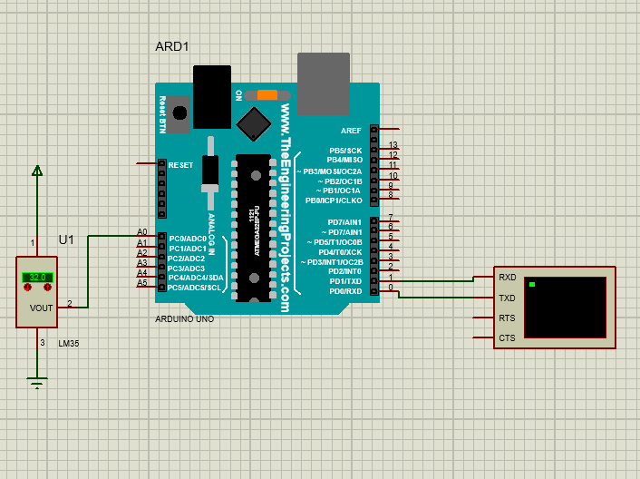

# Circuit of the Diagram

 

# Working of the Project

## Software

## Hardware

## Accuracy/ Verifictation of Hardware

 

# Code

[ Check the Arduino  code Here ](./Temp/Temp.ino)
 
[Check the Hardware  code of Arduino from here](lm35&oled.ino)

# Setup to Run the Project

# For Proteus/Software

<ul>
<li><b>Clone the Repo or Download the ZIP </li>

  [ 2.Open the Proteus file  click here](Temp-Setup.pdsprj) 

<li> Now Right Click on the Arduino Board in Proteus  </li>

[ 4.Open the Hex file  click here](./Temp/build/arduino.avr.uno/Temp.ino.hex) 

<li>Run the Simultation</li>
</ul>

# For Hardware

LM 35 Connection to A0
 
OLED  Screen Connection:-
 
SCL-A5
 
SDA-A4

